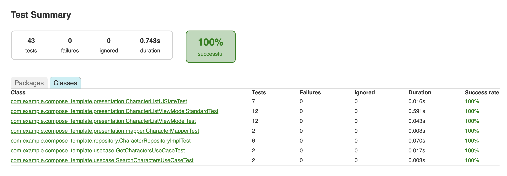

# Compose-MVI-Template

This repository contains a detailed sample app that apply MVI presentation architecture and uses Coroutines, Hilt, Compose. 

---
### Build and Run

To be able to build and run the app, you must have `JDK 17` installed on your machine.
After cloning the project and syncing gradle, run the following command to compile, install and run the application.
```sh
./gradlew assembleDebug && adb install -r app/build/outputs/apk/debug/app-debug.apk && adb shell am start -n com.example.compose_template/.MainActivity
```

---

### Testing

The application currently have a set of unit tests to validate `some` of the test cases. To run the available unit tests run the following command  

```sh
./gradlew :app:testDebugUnitTest
```

You will have a generated report file at `app/build/reports/tests/testDebugUnitTest/` labeled index.html where you can check unit tests results.  
It should look like this 

---

### Architectural Choices

##### - MVI Presentation Pattern
ViewModel handles all business logic, state management, and interactions with use cases or repositories. States are handled using Intents and State model to be updated and reflected on UI easily.

##### - Clean Architecture
Features are split into presentation, domain, and data layers:
- Presentation: Composables, ViewModels and State Handling.
- Domain: Use cases encapsulate business rules.
- Data: Repositories and API services.

##### - Kotlin Coroutines & Flow
Coroutines are used for asynchronous operations. Flow is used for exposing reactive streams from the repository/use cases to ViewModel.

##### - Jetpack Compose
Compose is used for the UI layer. Facilitate the UI design using declarative UI.

##### - Hilt for Dependency Injection
Hilt is used for dependency injection across ViewModels and repositories.

##### - Navigation
Jetpack Compose Navigation handles screen transitions.

##### - Caching & Pagination
Cached data is stored in memory in the ViewModel for offline-first feel.
Pagination logic ensures efficient network usage and smooth scrolling for long lists.

##### - Testing
ViewModels are unit-testable. Uses Turbine for testing Flow emissions. Mockito for mocking.

---

### Next Steps
 - [ ] Replace mockito with mockk
 - [ ] Add UI Tests
